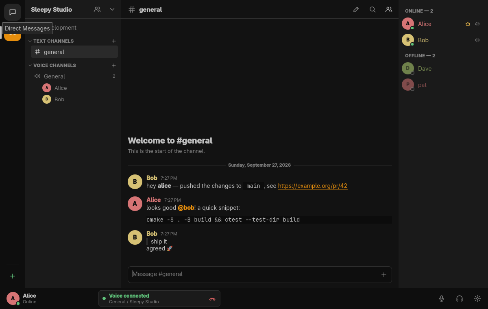

# OmaChat

**The native communications layer for Omarchy: fast text, low-latency voice,
keyboard-first control, and self-hostable infrastructure — no browser runtime.**

IRC simplicity + TeamSpeak latency + Discord usability, as native Linux
software: C++20, Qt 6 / Qt Quick, PipeWire, Opus, SQLite, TLS 1.3.
OmaChat is a communication tool, not an AI product: it contains no
assistants, bots or LLM features.



## What you get

- Servers with categories, text channels and voice channels; direct
  messages and group conversations (3–10 people), end-to-end encrypted
  with safety numbers (text and files; see [security](docs/security.md))
- Channel icons, banners and descriptions, bounded channel/server artwork cropping,
  keyboard or pointer placement, current-user access review, and checked channel
  detail saves that retain edits when another administrator changes the channel
- Persistent history (paged, 50 at a time), edits, deletes, replies,
  @mentions, reactions, typing indicators, full-text search of a channel
  or a whole server
- [Discord channel import](docs/discord-migration.md) from JSON exports in Add Server,
  with an offline operator tool for existing servers
- File attachments: picker, drag and drop, pasted images, aspect-correct inline
  previews with animated GIF playback and first-frame video thumbnails;
  audio and video have in-chat playback and volume controls, audio has a level
  visualizer,
  and the preview surfaces open audio in the desktop's default player or video
  in MPV (installed separately);
  transfers continue after a dropped connection
- Markdown subset (`**bold**`, `*italic*`, `~~strike~~`, `` `code` ``,
  fenced code blocks, `> quotes`, links) rendered through a sanitizer —
  raw HTML is always shown literally
- Voice: Opus 48 kHz mono, 20 ms frames, adaptive jitter buffers, FEC/PLC,
  voice activity / push-to-talk / always-on, mute and deafen, per-user local
  volume, RNNoise noise suppression, device hot-plug via PipeWire
- Screen sharing in voice channels: the desktop's own screen/window picker
  (xdg-desktop-portal), H.264 on the GPU (NVENC, AMF) or CPU (x264), up to
  1440p60, with other applications' sound; people choose whether to watch
- Roles and per-channel permission overrides with an editor in the GUI,
  kick, ban, server mute — all enforced by the server
- Several accounts (on one or more servers) connected at once, switched
  instantly; background accounts still notify
- Presence (online, idle, do not disturb, offline) and desktop notifications
  for DMs and mentions that respect DND and muted channels
- Profiles with editable display name, bio and HTTPS avatar image; view a
  member's profile from the member list
- `omachatd` keeps your session and voice call alive when the window closes
- `omachatctl` for scripts and compositor keybindings, with stable JSON
- IRC-style commands: `/join /leave /msg /reply /me /mute /unmute /deafen
  /undeafen /topic /invite /kick /ban /status /help`
- Keyboard first: `Ctrl+K` quick switcher, `Ctrl+Shift+M` mute,
  `Ctrl+Shift+D` deafen, `Alt+↑/↓` channels, `Ctrl+L` channel list,
  `Ctrl+F` search, `Ctrl+/` help, `Up` edits your last message,
  `Tab` completes `@user`, `#channel` and `/commands` (all configurable)
- Omarchy theme colors applied live; interface scale and reduced motion in Settings;
  optional bar widget for Omarchy

## Install

**Client (Arch / Omarchy):**

```bash
yay -S omachat   # or: paru -S omachat
```

(<https://aur.archlinux.org/packages/omachat>). Installs the client, daemon,
CLI and server in one package. Then, optionally, add the
[Omarchy bar widget](#omarchy-integration-optional).

No AUR helper installed? Use the one-line script instead — it installs
build dependencies and builds the same package with `makepkg`:

```bash
curl -fsSL https://raw.githubusercontent.com/Sleepy-Studio/OmaChat/main/scripts/install.sh | bash
```

Quiet by default (a one-line status per step); add `OMACHAT_VERBOSE=1` before
the pipe for full dependency, compiler and test output.

See [Build](#build) below to build from source instead.

**Self-hosted server, any OS with Docker:**

```bash
docker run -d --name omachat-server --restart unless-stopped \
    -p 6473:6473/tcp -p 6474:6474/udp \
    -v omachat-data:/var/lib/omachat \
    -e OMACHAT_HOSTNAME=chat.example.org \
    ghcr.io/sleepy-studio/omachat-server:latest
```

Generates its own config and a self-signed certificate on first run —
`docker logs omachat-server` shows the fingerprint to give your users. Full
guide, including a `docker-compose.yml`: [docs/self-hosting.md](docs/self-hosting.md).

## Components

| Binary | Role |
|---|---|
| `omachat` | Qt Quick desktop client |
| `omachatd` | per-user communications daemon (`systemctl --user … omachat.service`) |
| `omachatctl` | command-line client |
| `omachat-server` | self-hostable server |

See [docs/architecture.md](docs/architecture.md), [docs/protocol.md](docs/protocol.md),
[docs/media.md](docs/media.md), [docs/security.md](docs/security.md) and
[docs/self-hosting.md](docs/self-hosting.md). Current progress and what's
next: [docs/status.md](docs/status.md).

## Build

For development, or to build for a distribution the install script doesn't
cover yet. On Arch Linux:

```bash
sudo pacman -S --needed cmake ninja gcc qt6-base qt6-declarative qt6-svg qt6-wayland qt6-multimedia qt6-imageformats \
    qtkeychain-qt6 protobuf libsodium opus libpipewire openssl tomlplusplus rnnoise ffmpeg gtest
cmake -S . -B build -G Ninja -DCMAKE_BUILD_TYPE=RelWithDebInfo
cmake --build build
ctest --test-dir build              # unit, integration and fuzz suites
```

CMake options: `OMACHAT_BUILD_CLIENT`, `OMACHAT_BUILD_DAEMON`,
`OMACHAT_BUILD_SERVER`, `OMACHAT_BUILD_CLI`, `OMACHAT_BUILD_TESTS`
(all `ON`), `OMACHAT_ENABLE_FUZZERS` (libFuzzer targets, clang),
`OMACHAT_WARNINGS_AS_ERRORS`. RNNoise is optional; without it noise
suppression is reported as unavailable.

### Package

```bash
cd packaging/arch
OMACHAT_SRC=$PWD/../.. makepkg -si      # build the working tree
```

The package installs the binaries, desktop entry
(`org.omarchy.OmaChat.desktop`, also the `omachat://` link handler), icon,
the `omachat.service` user unit, and the server's system unit and sysusers
entry. Uninstalling never deletes your data.

## Run

```bash
systemctl --user enable --now omachat.service   # optional; the GUI starts it on demand
omachat
```

On first launch, enter your server, username and password (or register). If
the server uses a self-signed certificate you will be shown its SHA-256
fingerprint and must explicitly trust it.

From a terminal:

```bash
omachatctl account login chat.example.org:6473 howie   # prompts for the password
omachatctl status
omachatctl status --json
omachatctl server list
omachatctl channel list
omachatctl message send general "hello"
omachatctl message send general "logs" --attach ./crash.log --attach ./shot.png
omachatctl attachment get ATTACHMENT_ID --output ~/Downloads
omachatctl message search --server "Sleepy Studio" release notes
omachatctl group create alice bob --name "Weekend"
omachatctl voice join General
omachatctl mute | unmute | deafen | undeafen
omachatctl ptt begin | ptt end
omachatctl stream start      # opens the desktop's screen/window picker; silent by default
omachatctl stream start --audio # opt in to all other applications' sound
omachatctl e2e safety alice  # compare with Alice to verify encryption
omachatctl account list      # * marks the active account; all stay connected
omachatctl account switch 2
omachatctl events voice      # stream events as JSON lines
```

Exit codes: `0` ok, `1` command failed, `2` usage error, `3` daemon not running.

### Global push-to-talk (Hyprland / Omarchy)

Wayland does not let applications grab keys globally, so bind them in the
compositor. In `~/.config/hypr/bindings.conf`:

```ini
bind  = , F8, exec, omachatctl ptt begin
bindr = , F8, exec, omachatctl ptt end
```

Then choose **Push to talk** under Settings → Voice & Audio (or
`omachatctl voice mode ptt`). Inside the window, `F8` works without any
binding.

## Omarchy integration (optional)


A bar widget shows your voice channel and speaker count (`General · 3`);
left-click opens compact controls (mute, deafen, leave, open OmaChat),
middle-click toggles mute, right-click opens the app. It talks to
`omachatd` over the local socket and shows a dim icon when the daemon is
not running.

The AUR/PKGBUILD package ships the plugin files; wire it up per-user with:

```bash
omachat-omarchy-plugin install      # copies into ~/.config/omarchy/plugins, validates, enables
omachat-omarchy-plugin uninstall    # disables and removes it
```

(Building from source instead? The same script lives at
`integrations/omarchy/omachat-omarchy-plugin`.)

OmaChat works fully without the plugin, and outside Omarchy on any Wayland
desktop (built-in dark theme, same features).

## Configuration

`~/.config/omachat/config.toml` (XDG). Written by the Settings dialog; never
contains secrets.

```toml
[startup]
launch_daemon = true

[audio]
input = "default"          # or a PipeWire node name from `omachatctl audio devices`
output = "default"
mode = "vad"               # vad | ptt | always
noise_suppression = true
vad_threshold_db = -50.0
bitrate = 40000            # 24000 - 96000

[video]                    # screen sharing (what you send)
fps = 30                   # 5 - 60
max_height = 1080          # 360 - 1440
bitrate_kbps = 4000        # 500 - 20000
encoder = "auto"           # auto | nvenc | amf | x264
audio = false              # opt in: shares all other applications' sound

[notifications]
messages = true            # direct messages
mentions = true
voice_join = false

[ui]
compact_mode = true
scale = 1.0
reduced_motion = false

[shortcuts]
quick_switcher = "Ctrl+K"
toggle_mute = "Ctrl+Shift+M"
push_to_talk = "F8"
```

Data: `~/.local/share/omachat/omachat.db` (accounts, pinned certificates,
per-user volume, muted channels). Sessions: your Secret Service keyring.
Socket: `$XDG_RUNTIME_DIR/omachat/omachat.sock`.

## Development

- Tests: `ctest --test-dir build -L unit|integration|fuzz`. Integration
  tests run a real TLS server and real daemons in-process (null audio
  device) and push a synthetic tone through the full voice path.
- Run isolated daemons: `omachatd --socket /tmp/a.sock --database /tmp/a.db
  --memory-credentials --null-audio`; point clients at it with
  `OMACHAT_SOCKET=/tmp/a.sock` or `omachatctl --socket …`.
- `OMACHAT_LOG_LEVEL=trace|debug|info|warning|error`.
- `omachat --screenshot out.png` renders the window offscreen
  (`QT_QPA_PLATFORM=offscreen`) for docs and UI checks.
- Style: `clang-format` (`.clang-format`), warnings are kept at zero.

## Status: 0.2 (early)

`v0.2.2` is the latest tag; see [the development status](docs/status.md) for
its verification and release plan.

Working and tested (see `ctest`): accounts, sessions and resume, TLS with
explicit certificate trust, servers, invites, categories, text and voice
channels, history, edits, deletes, replies, mentions, reactions, channel
and server-wide search, DMs and group conversations, presence, typing,
roles/overrides/kick/ban/server-mute enforced server-side with a GUI
editor, voice (verified end-to-end through the relay with a synthetic
device clock, and with real PipeWire devices on one machine), mute,
deafen, VAD, push-to-talk, reconnect after server restart with automatic
voice rejoin, file attachments (picker, drag and drop, pasting images,
inline previews, transfers that survive closing the window and a dropped
connection), screen sharing (encode → relay → decode → GUI verified with a
synthetic source), several accounts at once, end-to-end encrypted
conversations, CLI with JSON, desktop notifications, Omarchy bar widget.

Not done yet — be aware:

- **Voice between two separate machines has not been tested yet**, and
  mouth-to-ear latency on real hardware has not been measured.
- Screen capture through the desktop portal has not been tried by hand
  yet (the rest of the video path is tested). Shared sound is opt-in,
  mono, and comes from all other applications, not only the shared window.
  The GUI confirms each share with sound.
- See [docs/status.md](docs/status.md) for the current list.

## License

MIT — see [LICENSE](LICENSE).

## Android

A native Kotlin/Compose Android client is being implemented in `android/`.
The current vertical slice connects directly over TLS, supports community text,
history, replies/edits/deletion/reactions, persisted drafts/outbox, and foreground
recovery. Independent Android keys interoperate with desktop encrypted DMs,
groups, edits and files, with safety numbers and key-change warnings. Native voice
now has explicit ownership/transfer controls and a microphone foreground service;
physical audio/routes/calls remain unverified. Persisted transfer resume, push, OAuth
and screen-share viewing remain pending; this is not a completed mobile release.

See [build/install and emulator tests](docs/android.md),
[architecture](docs/android-architecture.md),
[additive protocol changes](docs/mobile-protocol-changes.md), and
[actual verification status](docs/android-implementation-status.md).
